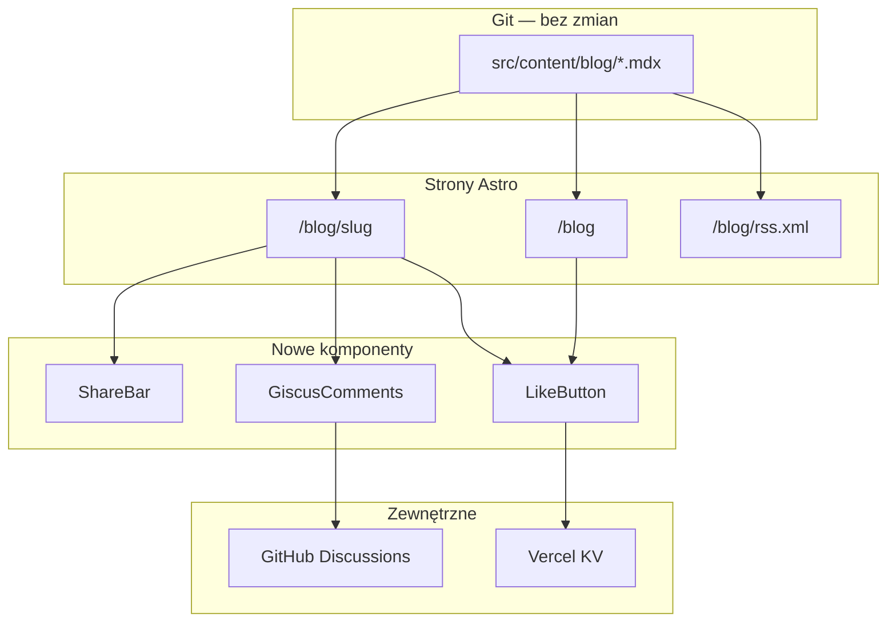

# Blog: share, RSS, Giscus, lajki (Vercel KV)

## Stan wyjściowy

Blog już działa na plikach MDX w [`src/content/blog/`](src/content/blog/) ze schematem w [`src/content/config.ts`](src/content/config.ts). Strony: [`src/pages/blog/index.astro`](src/pages/blog/index.astro), [`src/pages/blog/[...slug].astro`](src/pages/blog/[...slug].astro). Brak RSS, share, komentarzy i lajków. Backend: Astro Actions + reCAPTCHA ([`src/actions/index.ts`](src/actions/index.ts)), deploy na Vercel SSR ([`astro.config.mjs`](astro.config.mjs)).

Repo GitHub: `smelter-labs/smelter-website`, gałąź **`main`** (potwierdzone).



---

## 1. Helpery i stałe bloga

Rozszerzyć [`src/components/blog/blogHelpers.ts`](src/components/blog/blogHelpers.ts):

- `BLOG_SITE_ORIGIN = "https://smelter.dev"`
- `BLOG_GITHUB_REPO = "smelter-labs/smelter-website"`, `BLOG_GITHUB_BRANCH = "main"`
- `postUrl(slug)`, `githubSourceUrl(slug)` → `https://github.com/smelter-labs/smelter-website/blob/main/src/content/blog/{slug}.mdx`
- `buildShareLinks(title, url)` — X, LinkedIn, Hacker News, Reddit (encodeURIComponent)
- `visitorLikeKey(slug, fingerprint)` — klucz deduplikacji w KV

---

## 2. Share bar + GitHub source

Nowy komponent [`src/components/blog/ShareBar.astro`](src/components/blog/ShareBar.astro):

- Props: `title`, `slug`
- Rząd ikon-linków (inline SVG, styl zgodny z blogiem: mono, uppercase labels, border jak karty)
- Akcje: X, LinkedIn, HN, Reddit, **Copy link** (mały inline `<script>` + `navigator.clipboard`, fallback `prompt`)
- Link **View on GitHub** → `githubSourceUrl(slug)`, `target="_blank"`

Umiejscowienie w [`src/pages/blog/[...slug].astro`](src/pages/blog/[...slug].astro): pod linią metadanych (data · author), nad miniaturą.

---

## 3. Per-post Open Graph

Rozszerzyć props w [`src/layouts/MainLayout.astro`](src/layouts/MainLayout.astro):

```ts
ogUrl?: string;
ogImage?: string;
ogType?: string; // default "website", blog → "article"
```

Użyć `canonicalUrl` / `ogImage` zamiast hardcoded `https://smelter.dev/` i globalnego `og-image.png`. Blog post przekaże:

- `ogUrl={canonicalUrl}`
- `ogImage={data.cover.startsWith("http") ? data.cover : `https://smelter.dev${data.cover}`}`
- `ogType="article"`

---

## 4. RSS feed

- Dodać zależność `@astrojs/rss`
- Nowy endpoint [`src/pages/blog/rss.xml.ts`](src/pages/blog/rss.xml.ts):
  - `getCollection("blog", !draft)`, sort po dacie desc
  - `site: "https://smelter.dev"`, `stylesheet: false`
  - `customData: "<language>en</language>"`
  - każdy item: `link`, `title`, `description`, `pubDate`, opcjonalnie `categories: [category]`
- Link `<link rel="alternate" type="application/rss+xml" href="/blog/rss.xml" />`:
  - w `<Fragment slot="head">` na [`src/pages/blog/index.astro`](src/pages/blog/index.astro)
  - opcjonalnie też na stronie posta

---

## 5. Giscus (komentarze)

Nowy komponent React [`src/components/blog/GiscusComments.tsx`](src/components/blog/GiscusComments.tsx):

- `client:visible` (lazy load — nie blokuje LCP)
- `@giscus/react` **lub** dynamiczny `<script src="https://giscus.app/client.js">` (bez nowej zależności — preferować script embed, mniejszy bundle)
- Props/env (public, w [`astro.config.mjs`](astro.config.mjs) `env.schema`):
  - `PUBLIC_GISCUS_REPO` (np. `smelter-labs/smelter-website`)
  - `PUBLIC_GISCUS_REPO_ID`
  - `PUBLIC_GISCUS_CATEGORY` (np. `Blog`)
  - `PUBLIC_GISCUS_CATEGORY_ID`
- Konfiguracja: `mapping="pathname"`, `term="/blog/{slug}"`, `theme="noborder_dark"` (dopasować do ciemnego UI)
- Jeśli brak env → komponent nie renderuje się (dev-friendly)

Umiejscowienie: pod `.blog-prose`, sekcja „Comments” z separatorem.

**Setup manualny (przed deployem):**
1. Włączyć GitHub Discussions na `smelter-labs/smelter-website`
2. Utworzyć kategorię „Blog”
3. Skonfigurować na [giscus.app](https://giscus.app) → skopiować repo/category IDs do Vercel env

---

## 6. Lajki (Vercel KV)

### Zależność i env

- Dodać `@vercel/kv`
- Sekrety serwerowe (Vercel KV store powiązany z projektem):
  - `KV_REST_API_URL`
  - `KV_REST_API_TOKEN`

### Refactor reCAPTCHA

Wydzielić weryfikację z [`src/actions/index.ts`](src/actions/index.ts) do [`src/utils/verifyRecaptcha.ts`](src/utils/verifyRecaptcha.ts) — reuse w contact i like.

### Astro Actions

Rozszerzyć [`src/actions/index.ts`](src/actions/index.ts):

| Action | Input | Logika |
|--------|-------|--------|
| `getBlogLikeCount` | `{ slug: string }` | `KV.get("blog:likes:{slug}")` → number (0 jeśli brak) |
| `likeBlogPost` | `{ slug, recaptchaToken }` | verify reCAPTCHA (action `blog_like`) → fingerprint z IP + UA → jeśli `blog:liked:{slug}:{fp}` istnieje, return current count → else `INCR blog:likes:{slug}`, `SET liked key` z TTL 365d |

Fingerprint: `SHA-256` z `x-forwarded-for` + `user-agent` (z `Astro.request.headers` w handlerze).

### UI — `LikeButton.tsx`

Nowy [`src/components/blog/LikeButton.tsx`](src/components/blog/LikeButton.tsx):

- Props: `slug`, opcjonalnie `compact` (wariant na karcie)
- Mount: `actions.getBlogLikeCount({ slug })`
- `localStorage` key `blog-liked-{slug}` — optimistic UI, disable po lajku
- Click: reCAPTCHA `blog_like` → `actions.likeBlogPost`
- Bez KV w dev: gracefully pokazuje 0, like no-op z komunikatem w console (nie crash)

### Gdzie osadzić (post + karty)

- [`src/pages/blog/[...slug].astro`](src/pages/blog/[...slug].astro) — obok ShareBar
- [`src/components/blog/PostCard.astro`](src/components/blog/PostCard.astro) — `<LikeButton slug={entry.id} compact client:visible />` w stopce karty (nie wewnątrz `<a>`, żeby klik nie nawigował)
- [`src/components/blog/FeaturedPost.astro`](src/components/blog/FeaturedPost.astro) — ten sam wzorzec

---

## 7. Pliki do utworzenia / zmiany

| Plik | Akcja |
|------|-------|
| `src/components/blog/blogHelpers.ts` | rozszerzyć |
| `src/components/blog/ShareBar.astro` | nowy |
| `src/components/blog/LikeButton.tsx` | nowy |
| `src/components/blog/GiscusComments.tsx` | nowy |
| `src/pages/blog/rss.xml.ts` | nowy |
| `src/pages/blog/[...slug].astro` | ShareBar, LikeButton, Giscus, OG props |
| `src/pages/blog/index.astro` | RSS link w head |
| `src/components/blog/PostCard.astro` | LikeButton compact |
| `src/components/blog/FeaturedPost.astro` | LikeButton compact |
| `src/layouts/MainLayout.astro` | opcjonalne OG props |
| `src/actions/index.ts` | like actions + refactor |
| `src/utils/verifyRecaptcha.ts` | nowy |
| `astro.config.mjs` | env schema Giscus |
| `package.json` | `@astrojs/rss`, `@vercel/kv` |

---

## 8. Setup manualny (checklist po merge)

1. **GitHub Discussions** — włączyć na repo, kategoria „Blog”
2. **Giscus** — [giscus.app](https://giscus.app) → 4 public env vars w Vercel
3. **Vercel KV** — Storage → Create KV → Connect to Project → auto-inject `KV_*` vars
4. **reCAPTCHA** — nowa action `blog_like` w Google Cloud console (jeśli wymagane per-action; v3 zwykle działa z dowolną action string)
5. Lokalnie: skopiować env z Vercel do `.env` (dev) lub zaakceptować, że lajki/Giscus działają tylko na preview/prod

---

## 9. Weryfikacja

- `pnpm astrocheck` + `pnpm check`
- `/blog` — karty z licznikami lajków, RSS link w head
- `/blog/rss.xml` — poprawny XML z wszystkimi postami
- `/blog/{slug}` — share linki, GitHub source, like, Giscus pod treścią
- Share preview: poprawny `og:image` z cover posta
- Like: jeden klik = +1, drugi = brak zmiany; odświeżenie strony = ta sama liczba
